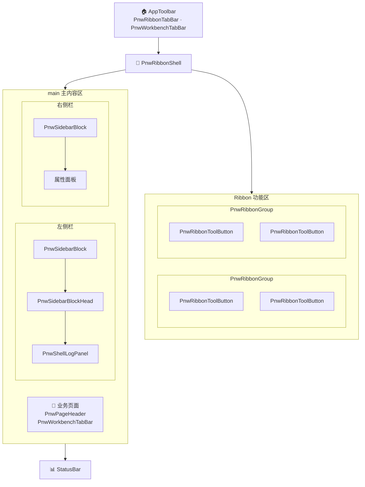
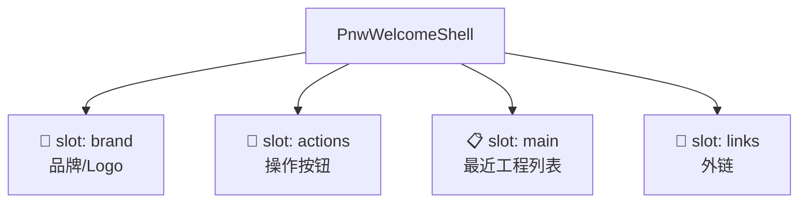
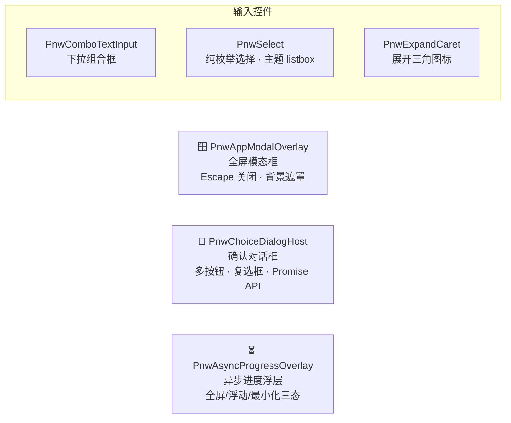
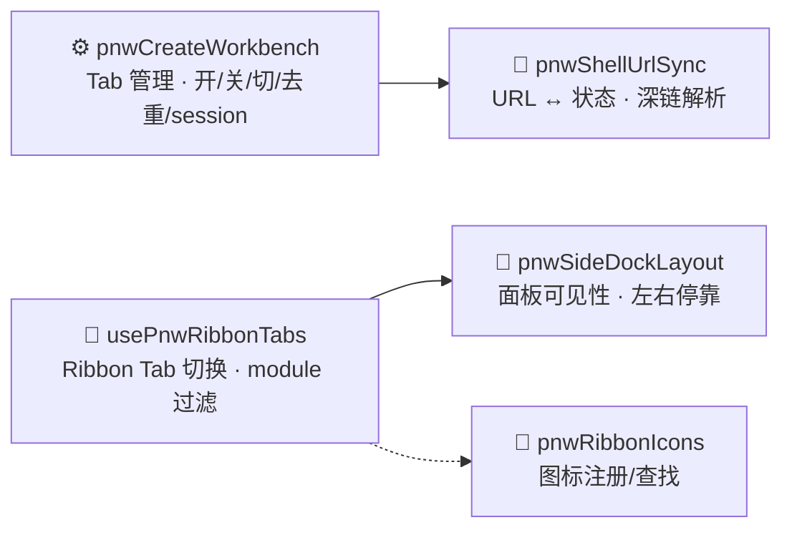
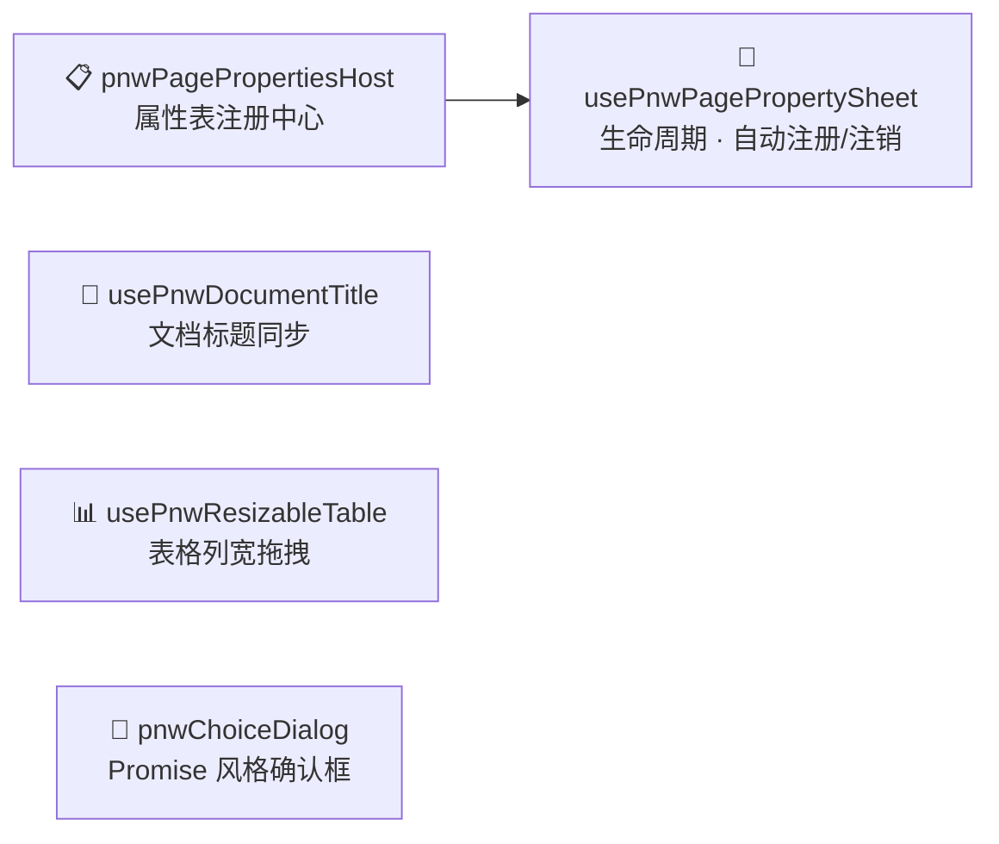

# phoenix-wing 壳层架构图

phoenix-wing v0.1 提供完整壳层框架，消费项目可直接搭积木使用。

## 组件树（全 Pnw 前缀）

```
┌─ 应用壳层（phoenix-wing v0.1 全部组件，可直接搭积木使用）──────────────┐
│                                                                       │
│  ┌─ PnwWorkspaceGate → PnwWelcomeShell（欢迎页全屏替换整个壳层）─┐   │
│  │  [Brand]  PnwRibbonTabBar  ·  PnwWorkbenchTabBar(inHeader)    │   │
│  ├─ PnwRibbonShell ─────────────────────────────────────────────┤   │
│  │  ┌─ PnwRibbonGroup ───────┐  ┌─ PnwRibbonGroup ───────┐     │   │
│  │  │  PnwRibbonToolButton   │  │  PnwRibbonToolButton   │     │   │
│  │  │  PnwRibbonToolButton   │  │  PnwRibbonToolButton   │     │   │
│  │  │  PnwRibbonToolButton   │  │  PnwRibbonToolButton   │     │   │
│  │  └────────────────────────┘  └────────────────────────┘     │   │
│  │  PnwRibbonUtilButton  ·  PnwRibbonTabBar                    │   │
│  ├─ main ──────────────────────────────────────────────────────┤   │
│  │  ┌─ PnwSidebarBlock ─────────┐  ┌─ 内容区 ─────────────┐  │   │
│  │  │  PnwSidebarBlockHead      │  │                       │  │   │
│  │  │  · 文件树 / CAA 树        │  │  业务页面              │  │   │
│  │  │  · 筛选面板               │  │  PnwPageHeader        │  │   │
│  │  │  · 属性面板               │  │  PnwWorkbenchTabBar   │  │   │
│  │  │  · Git 提交面板           │  │                       │  │   │
│  │  │  · PnwShellLogPanel       │  │                       │  │   │
│  │  └───────────────────────────┘  └───────────────────────┘  │   │
│  │  PnwSidebarBlock（右侧 · 属性/日志/工作集）                  │   │
│  ├─ StatusBar ─────────────────────────────────────────────────┤   │
│  │  状态文本  ·  PnwShellLogPanel  ·  面板开关按钮              │   │
│  └──────────────────────────────────────────────────────────────┘   │
│                                                                       │
│  全局覆盖层（Teleport 到 body）:                                       │
│  ┌─ PnwAppModalOverlay …… 全屏模态框（配置 / 关于）                   │
│  ├─ PnwChoiceDialogHost …… 确认对话框（多按钮 + 复选框 · Promise API） │
│  └─ PnwAsyncProgressOverlay …… 异步进度浮层（全屏/浮动/最小化三态）    │
└───────────────────────────────────────────────────────────────────────┘
```

### 壳层布局



### 欢迎页

`PnwWorkspaceGate` 在 Workbench 外层解析 required/optional 策略；Welcome 不是 View、Tab 或
MRU 项。进入工作台后，普通默认页可使用 `PnwWorkbenchHome`，其内部卡片、巡游和业务动作
均由消费者 slot 定义。



### 全局覆盖层



---

## 引擎关系图

**核心引擎**



**页面与工具**



---

## 组件清单

### 壳层布局组件

| 组件 | 文件 | 说明 |
|------|------|------|
| `PnwRibbonShell` | `layout/PnwRibbonShell.vue` | Ribbon 容器（折叠/展开） |
| `PnwRibbonTabBar` | `layout/PnwRibbonTabBar.vue` | 功能标签切换条 |
| `PnwRibbonGroup` | `layout/PnwRibbonGroup.vue` | 按钮分组容器 |
| `PnwRibbonToolButton` | `layout/PnwRibbonToolButton.vue` | 工具按钮（stacked/inline 双模式） |
| `PnwRibbonUtilButton` | `layout/PnwRibbonUtilButton.vue` | 通用工具按钮 |
| `PnwSidebarBlock` | `layout/PnwSidebarBlock.vue` | 可折叠侧栏块（strip/card） |
| `PnwSidebarBlockHead` | `layout/PnwSidebarBlockHead.vue` | 侧栏块标题行 |
| `PnwPageHeader` | `layout/PnwPageHeader.vue` | 页面标题头 |
| `PnwShellLogPanel` | `layout/PnwShellLogPanel.vue` | 日志面板 |
| `PnwWorkbenchTabBar` | `layout/PnwWorkbenchTabBar.vue` | 页面标签栏 |
| `PnwWelcomeShell` | `layout/PnwWelcomeShell.vue` | 欢迎页骨架（slot 化） |
| `PnwWorkspaceGate` | `layout/PnwWorkspaceGate.vue` | 全屏 Welcome / Workbench 受控入口 |
| `PnwWorkbenchHome` | `layout/PnwWorkbenchHome.vue` | 普通 Home View 壳体（内部完全 slot 化） |

### 弹窗/覆盖层

| 组件 | 文件 | 说明 |
|------|------|------|
| `PnwAppModalOverlay` | `components/PnwAppModalOverlay.vue` | 全屏模态框 |
| `PnwChoiceDialogHost` | `components/PnwChoiceDialogHost.vue` | 确认对话框 |
| `PnwViewDialogHost` | `components/PnwViewDialogHost.vue` | 非模态 View Dialog 全局 renderer Host |
| `PnwAsyncProgressOverlay` | `components/PnwAsyncProgressOverlay.vue` | 异步进度浮层 |
| `PnwComboTextInput` | `components/PnwComboTextInput.vue` | 组合输入框 |
| `PnwSelect` | `components/PnwSelect.vue` | compact/default 纯枚举选择与 Teleport listbox |
| `PnwExpandCaret` | `components/PnwExpandCaret.vue` | 展开图标 |

### 引擎 / Composable

| 模块 | 说明 |
|------|------|
| `pnwCreateWorkbench` | Tab 管理引擎 |
| `usePnwRibbonTabs` | Ribbon Tab 切换 |
| `pnwRibbonIcons` | 图标注册/查找 |
| `pnwShellUrlSync` | URL 同步 |
| `pnwSideDockLayout` | 侧栏布局计算 |
| `usePnwDocumentTitle` | 文档标题 |
| `usePnwResizableTable` | 表格列宽拖拽 |
| `pnwPagePropertiesHost` | 属性表注册中心 |
| `usePnwPagePropertySheet` | 属性表生命周期 |
| `pnwChoiceDialog` | 确认对话框 |
