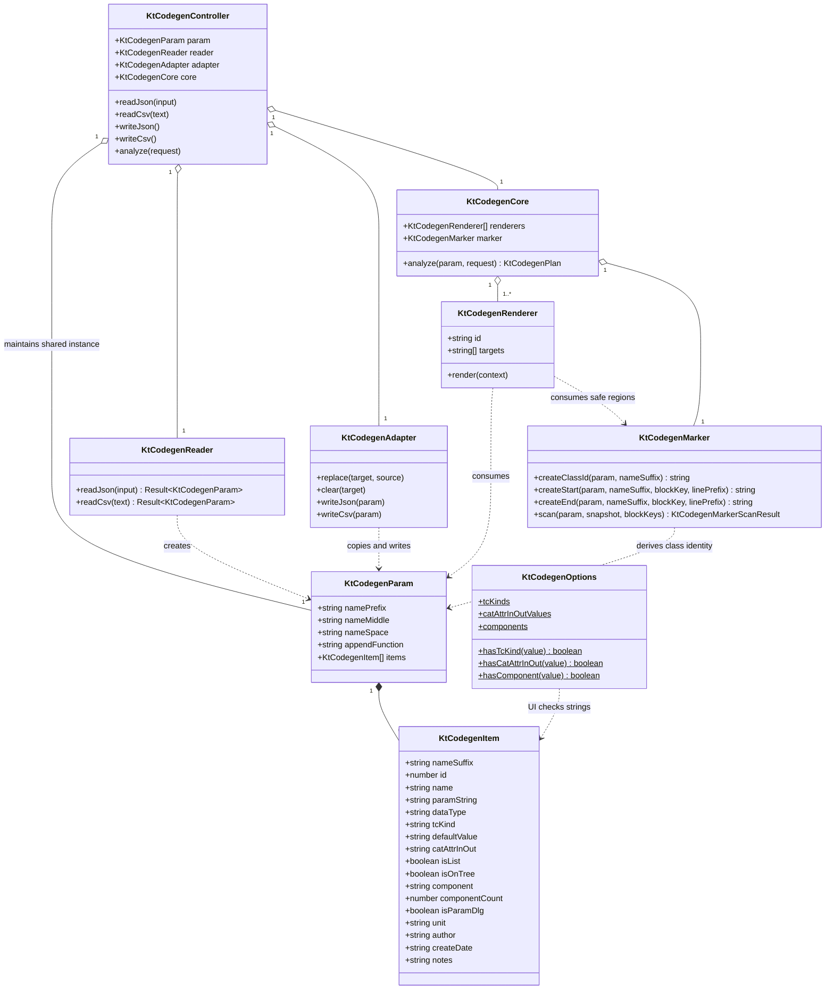

# KtCodegen 参数代码生成核心

这是从 `KtAutoCode` 本地归档标签 `kt-codegen-0.1.0` 迁入 Phoenix Wing 的参数驱动代码生成核心，npm 包名为 `@phoenix-wing/kt-codegen`。归档旧仓库继续作为 VB/C++/Qt 行为、许可和来源证据。

本包提供共享数据、旧格式兼容、只读源码标记扫描、32个生成块的 Core/Renderer、宿主无关的 Apply 投影/回滚事务，以及17列 Table Web Component。它不直接打开真实文件，也不依赖 VS Code、DeskTools 或其他产品壳；宿主通过只读快照和文件读写 Port 接入。

`@phoenix-wing/kt-codegen/ui` 的 Primary 面板顶层 Section 默认横向满宽；Section
之间 `gap: 0`，无横向边框与圆角卡片，只用下边框形成连续分隔。标题、列表、
表单与按钮各自在内部保留紧凑 padding，Host 不需要穿透 Shadow DOM 补外边距。

## 文件与命名规则

主要职责类直接平铺在 `src/`，不再为了 MVC-C 建立多层目录：

```text
src/
├── KtCodegenParam.ts       # 共享配置数据
├── KtCodegenItem.ts        # 单条17列参数数据
├── KtCodegenOptions.ts     # UI Combo 候选值
├── KtCodegenReader.ts      # CSV/JSON读取
├── KtCodegenAdapter.ts     # 旧格式写出、复制和清空
├── KtCodegenApply.ts       # Apply审计、纯文本投影与宿主无关回滚事务
├── KtCodegenController.ts  # 宿主编排
├── KtCodegenCore.ts        # 核心生成算法入口
├── KtCodegenMarker.ts      # 旧自动代码标记构造与只读扫描
├── KtCodegenRenderer.ts    # 稳定 Renderer facade 与公共契约
├── renderer/               # block family 策略、注册表与 legacy 兼容层
├── KtCodegenTableCore.ts   # 无 DOM 的整表编辑与 checkpoint
├── KtCodegenTableData.ts   # 宿主交换的整表 DTO
├── KtCodegenTableColumns.ts # 17列描述与字段类型
└── table/
    ├── KtCodegenTableViewModel.ts # 无 DOM 的动作、Combo、列宽与状态投影
    ├── KtCodegenTableStyle.ts     # pnw 类名、主题 token 与滚动视觉原语
    └── KtCodegenTable.ts          # browser-only Web Component
```

规则如下：

- 所有主要类统一使用 `KtCodegen*` 前缀；
- `Pnw` 保留给 Phoenix Wing 通用基础设施；参数自动代码领域即使迁入 Phoenix Wing 也继续使用 `KtCodegen`；
- 一个类一个 `.ts` 文件，文件名与类名完全一致；
- 类专用的小接口、类型可以留在同一文件；
- 多个共享的小枚举或类型以后可以集中到一个 `KtCodegenTypes.ts`；
- `index.ts` 只导出，不放实现；
- MVC-C 是职责划分，不通过目录层级表达。

`api/`、`blocks/`、`legacy/`、`model/` 放纯函数、旧格式 schema 和公共类型；`renderer/` 是明确的例外，它按 block family 隔离模板策略，根 `KtCodegenRenderer` 只保留公共 facade。

## Renderer family 注册表

32 个旧 block 已从中心 `if/else` 调度器拆为 10 个具名 family：普通 C++ Parameter、CAA Feature I/O、Catalog、Factory Tree、Dialog、Dialog Field、Command Agent 生命周期、Command Graph/State、Command Action 和 Qt Dialog。结构职责如下：

- `family-registry.ts` 只维护 `blockKey → family` 能力映射、artifact 安全区域绑定和待迁移诊断，不含任何 C++/CAA/Qt 模板；
- `caa-feature-families.ts`、`caa-dialog-family.ts`、`caa-command-families.ts`、`cpp-parameter-family.ts`、`qt-dialog-family.ts` 各自拥有模板和 item 筛选规则；
- `legacy-compatibility.ts` 统一保留旧 Start/End、Doxygen、EOL 和废弃 block warning 语义；
- `caa-renderer.ts` 只组合 family，不判断具体 block；根 facade 只创建平台 Renderer。

新增或迁移 block 时，应在所属 family 注册并添加独立 golden；不得把模板或 block 分支重新写回 `KtCodegenRenderer.ts`。`renderer-family-registry.test.ts` 会检查重复注册立即失败，并要求全部 32 个 migrated block 恰好归属一个 family。

完整的类型、函数、常量和运行时身份映射见[《KtCodegen 命名迁移说明》](doc/KtCodegen命名迁移说明.md)。

旧 VB/C++/Qt 权威实现、归档标签与许可证据见[《来源与许可归档》](doc/来源与许可归档.md)。

本次迁入的时间盒、仓库边界和发布门禁见[《两小时迁移计划与验收》](doc/两小时迁移计划与验收.md)。

32个旧生成块的分派依据、主目标、废弃状态和建议迁移顺序见[《参数代码生成块迁移矩阵》](doc/生成块迁移矩阵.md)。

旧 Start/End 文本协议、源码偏移和异常配对规则见[《自动代码标记扫描》](doc/自动代码标记扫描.md)。

Apply 默认保持 fail-closed，但允许一种明确的部分成功：当 Plan 的 error 仅为
`marker.missing-end` / `marker.orphan-end`，Marker 扫描器已经隔离不完整区域，
且其余 Target、Region 与 Artifact 绑定全部有效时，`ktCodegenProjectApply` 只
投影这些完整区域。模型、Renderer、Artifact 绑定、指纹、范围或重叠错误仍阻止
全部写入。宿主可用 `ktCodegenCanApplyValidRegions(plan)` 展示“可部分应用”状态。

首组已迁移 Renderer 的逐块行为和 golden 见[《普通 C++ 参数块迁移》](doc/普通C++参数块迁移.md)。

CAA 实现类/纯虚接口 Get/Set 差异见[《CAA 接口头文件块迁移》](doc/CAA接口头文件块迁移.md)。

CAA 单参数读写与 Param 聚合桥接见[《CAA 特征读写块迁移》](doc/CAA特征读写块迁移.md)。

CAA Catalog 注册、树工厂与标题规则见[《CAA 目录与树工厂块迁移》](doc/CAA目录与树工厂块迁移.md)。

CAA Dialog Agent 通知注册见[《CAA 对话框通知块迁移》](doc/CAA对话框通知块迁移.md)。

CAA/Qt Parameter 与 Dialog 的双向更新见[《CAA 与 Qt 对话框双向更新块迁移》](doc/CAA与Qt对话框双向更新块迁移.md)。

Dialog Field 枚举、Selector 访问与废弃兼容策略见[《Dialog 字段与废弃兼容块迁移》](doc/Dialog字段与废弃兼容块迁移.md)。

Command Agent 成员声明、构造初始化与析构清理见[《Command Agent 生命周期块迁移》](doc/CommandAgent生命周期块迁移.md)。

Command BuildGraph、FIA Clear 与 UpdateState 见[《Command 图与状态块迁移》](doc/Command图与状态块迁移.md)。

Command PDA/FIA Action、废弃选择逻辑与活动 Field 见[《Command 动作与活动字段块迁移》](doc/Command动作与活动字段块迁移.md)。

## 数据类边界

`KtCodegenParam` 和 `KtCodegenItem` 是纯数据类：只包含公开、可变字段和最小构造初始化，不包含 CSV/JSON、校验、清空、复制或生成算法。

旧系统的关键优势是 MVC-C（Model–View–Control–Core）围绕同一份 Parameter 数据协作。Parameter 采用类似 C/C++ `struct` 的全公开成员形式，不生成 getter/setter。Model、View、Control、Core、CAA 特征读写、Qt 对话框和普通 C++ 代码可以直接持有同一个实例；一处修改后，其他持有者立即看到新值。

这种设计主动牺牲一部分封装，换取调用路径短、表格/JSON/CSV 映射直接、自动代码模板样板少。代价是公开成员没有 setter 防线，调用者必须协调修改。新 TS 实现保留这一取舍，但把输入、适配、诊断、核心算法和源码 Apply 分离，避免数据类继续膨胀。

旧数据载体统一为：

| 旧实现 | 新对应 |
| --- | --- |
| VB `KevinCAAFileGuide` 的 `_Name*` 与 `_FieldList` | `KtCodegenParam` |
| VB `KevinCAAParamInfor` | `KtCodegenItem` |
| C++ `KtaControlConfigData` | `KtCodegenParam` |
| C++ `KtaControlConfigItem` | `KtCodegenItem` |
| Qt `KtdAutoCodeParam` 的配置字段 | `KtCodegenParam`；文件、搜索、选中行等宿主状态不迁入 |
| Qt `KtdAutoCodeItem` | `KtCodegenItem` |

## 类图



图中的关键边界是：`KtCodegenParam` 没有操作方法；Controller 只维护同一个共享实例；Reader 先产生临时数据，读取完整成功后再由 Adapter 用原数组 `splice` 更新共享实例；Marker 只消费 Param 和宿主源码快照，不把文件状态放回数据类；Core 把默认值算法注入 Renderer，避免 Renderer 反向依赖 Core；Renderer facade 再把只读算法交给具名 family，注册表不拥有模板。

## Combo 字符串规则

`tcKind`、`catAttrInOut`、`component` 等字段保持普通 `string`，不改为严格枚举。

- Reader 原样保留旧 CSV/JSON 字符串；
- Adapter 写回原始字符串，不清空、不替换；
- `KtCodegenOptions` 提供旧 Qt/VB 界面的固定候选值和查询函数；
- 当前值不在候选列表时，UI 负责提示错误并显示原值；
- 只有用户从 Combo 主动选择新值后，UI 才修改共享数据。

因此，配置即使经过界面打开，只要用户没有主动修正，未知值仍可无损写回。

## 共享 Table 组件

`KtCodegenTableCore` 从包根导出，只依赖 `KtCodegenParam`，可供 Node、测试、DeskTools store 或其他 UI 控制层直接复用。`KtCodegenTable` 从 browser-only 子路径 `@phoenix-wing/kt-codegen/table` 导出，模块加载不会自动注册自定义元素，也不会污染全局 DOM。

```ts
import type { KtCodegenTableData } from "@phoenix-wing/kt-codegen";
import {
  ktCodegenDefineTableElement,
  type KtCodegenTable,
} from "@phoenix-wing/kt-codegen/table";

ktCodegenDefineTableElement();
const table = document.querySelector<KtCodegenTable>("kt-codegen-table")!;
table.layout = "page";
table.collapsible = true;
table.setData(data);

table.addEventListener("kt-codegen-table-change", () => {
  // 宿主自行选择保存、页面隐藏或防抖时机，再整体取出；不需要逐单元格通信。
  const next: KtCodegenTableData = table.getData();
});

table.addEventListener("kt-codegen-table-collapse-change", (event) => {
  // 只响应用户点击；table.collapsed = true 不会回发事件。
  console.log(event.detail.collapsed);
});
```

- `setData()`/`getData()` 交换带 schema 与 `documentRevision` 的整表 DTO；返回值不暴露组件内部可变数组。
- Sort、Copy/Paste、Insert、Duplicate、Move、Delete 和列宽自适应属于组件内部操作。
- 动作可用性、Combo 未知值/空值/分隔项、列宽拟合与状态栏计数由 UI-neutral `KtCodegenTableViewModel.ts` 统一投影；Web Component 只把这些描述装配成 DOM。该文件纳入 pure import graph，不可依赖 DOM、Vue、Node 或宿主 API。
- Shadow DOM 的 `pnw-kt-codegen-table-*` 类名、VS Code token 回退、工具栏/表格滚动与 sticky 表头由内部 `KtCodegenTableStyle.ts` 单点维护；组件只按 class map 装配。选中行在表格区有焦点时使用 `list.activeSelection*`，焦点移出后切换到 `list.inactiveSelection*`，避免高对比主题继续用 active 背景显示失焦选择。该视觉原语也纳入 pure import graph，但不从 browser 子路径公开导出。
- `layout="contained"` 是兼容默认值，保留组件高度与内部双向滚动；`layout="page"` 使用自然高度，表格区只保留横向溢出，由 Page shell 负责唯一纵向滚动。空表提示在 page 模式进入文档流，不会被零高度容器裁切。
- `collapsible` 启用 Header disclosure button，`collapsed` 可由宿主静默反射；只有用户点击会发出 `kt-codegen-table-collapse-change`，程序设置不发 change/dirty/collapse 事件。收起只隐藏 table shell 与 statusbar，全部表格工具仍留在 Header。
- 本地构建后可用 `test-fixtures/table-runtime.html?layout=page&collapsible` 在浏览器点检真实 Shadow DOM、自然高度、横向滚动、折叠和焦点；追加 `empty`/`collapsed`/`rows=40` 可覆盖空表、初始收起与长表。该夹具不进入 npm `files` 白名单。
- `kt-codegen-table-change` 只提示“内部数据变化”；宿主决定何时获取整表。`kt-codegen-table-dirty-change` 只在 clean/dirty 跃迁时发出。
- `configure()` 可替换列描述和 Combo 候选；未知旧值仍显示并保持，不会因渲染被清空。
- 文件 URI、JSON/CSV、保存冲突、Preflight 编排和 Output/Problems 留在产品宿主；Apply 的纯文本投影、指纹复核和多文件回滚事务复用 `KtCodegenApply`。DeskTools 可直接组合组件或再包一层 Vue wrapper。

布局责任、属性反射、事件和无障碍边界见[《KtCodegenTable 布局与折叠契约》](doc/KtCodegenTable布局与折叠契约.md)。

## 共享 Apply 与宿主边界

`KtCodegenApply.ts` 把原先散落在产品宿主中的无 UI 算法集中为三组 API：

- `ktCodegenInspectApplyPlan()`：汇总 Target、Marker、Artifact、未命中控制符和“有 Marker 无 Artifact”状态，返回结构化数据；宿主自行格式化日志。
- `ktCodegenProjectApply()`：根据 `KtCodegenPlan`、源码文本与指纹形成整文件候选，校验区域缺失、重复、重叠、源码变化，并按目标 LF/CRLF 规范化生成文本；每个文件结果同时携带按源码顺序排列的 `region/artifact/block/class/line` 审计元数据。
- `ktCodegenCommitApplyWrites()`：通过泛型 `readFile`/`writeFile` Port 在每次写前复读字节；失败时逆序回滚，而且不会覆盖回滚期间出现的第三方内容。

Wing 不选择工作区、不弹窗、不发布 Problems、不决定源码编码，也不直接调用文件系统。VS Code/Desk Tools 负责工作区边界、未保存编辑器检查、UTF-8/GBK 编解码、真实文件 Port、Output 文本与诊断定位。这使两个宿主共享同一写回规则，同时保留各自 UI。

## 跨宿主契约与 fixtures

宿主在解释序列化 Analyze Plan 前必须调用 `ktCodegenCheckPlanCompatibility()`。当前只接受 `kind: "kt.codegen.plan"`、`schemaVersion: 1`；未知未来版本返回 `contract.unsupported-schema-version`，不能由宿主按字段猜测兼容。

`@phoenix-wing/kt-codegen/fixtures/codegen-host-contract-v1.json` 是 Analyze、marker、legacy v4 JSON 与 17 列 CSV 的联合 golden；它冻结参数归一化、Marker 字节偏移、Renderer 身份、Artifact 内容哈希和版本拒绝结果。`apply-projection-v1.json` 独立冻结 Apply 的 CRLF 投影、审计顺序、冲突码与最终 UTF-8 字节。Auto Code 与 Desk Tools 直接导入 Registry 包中的同一 fixture 并调用本包 API，不保存副本，也不复制协议解释。

fixtures 的 `schemaVersion` 是测试 bundle 版本，Analyze Plan 的 `schemaVersion` 是运行时 envelope 版本，两者都独立于 npm 包版本。变更任一公开语义时，必须新增版本或提供兼容判定，不能静默覆盖既有 v1 golden。

## 已迁移的参数核心语义

`KtCodegenCore` 已从 `KevinCAAParamInfor.vb` 提取第一组不依赖文件系统的纯 helper：

- 字符串默认值补引号；
- 分号恢复为 C++ 默认值列表中的逗号；
- `Spinner`/`QDoubleSpinBox` 的 `mm` 与 `degree/deg` 单位表达式转换；
- 旧3D点、向量、方向和射线类型集合；
- `IsParamSpecList` 的原判断顺序；
- 参数名末尾单独大写字符的提取规则；
- 五类 Dialog/Command Selector Field 的精确组件判断规则。

这些 helper 不修改 `KtCodegenItem`。默认值输出使用 [`core-default-values.json`](tests/fixtures/expected/core-default-values.json) 保存 golden cases，确保后续 Renderer 复用时保持旧行为。

## 使用方式

```ts
const controller = new KtCodegenController();

const loaded = controller.readCsv(csvText);
if (!loaded.ok) console.error(loaded.diagnostics);

// 数据类没有 getter/setter，也没有读写操作。
controller.param.items[0].defaultValue = "42";

// UI 可提示未知 Combo 值，但不能自动清空。
const known = KtCodegenOptions.hasComponent(
  controller.param.items[0].component,
);

const json = controller.writeJson();
const plan = controller.analyze({
  targets: ["caa.core", "qt.dialog", "cpp.parameter"],
  snapshot: {
    files: [{ path, text, fingerprint }],
  },
});

const audit = ktCodegenInspectApplyPlan(plan);
const projection = ktCodegenProjectApply(plan, [{ path, text, fingerprint }]);
// 宿主先按原编码把 projection.changes 编码为字节，再把文件 Port 交给事务层。
const committed = await ktCodegenCommitApplyWrites(filePort, encodedWrites);
```

## 已实现范围

- 旧17列 CSV 读取与写出；
- CSV 转旧 v4 JSON；
- 旧 v4 JSON 读取与写出；
- `Count`/`ComponentCount` 等历史别名；
- 未知 Combo 字符串无损保留；
- 32个旧 block key；
- 32个 block 的 VB 调用、源码位置、主目标和废弃状态迁移矩阵；
- 第一组默认值、类型和列表核心 helper；
- 旧 Kevin Start/End 标记构造、只读扫描和精确替换偏移；
- 标记孤立、缺失和错配诊断、未知 block 透传，并在下一个语法完整 Start 恢复扫描；
- 标记区域进入 Analyze Plan；
- 普通 C++ Parameter 的构造、声明、析构和赋值四块 Renderer；
- CAA 实现类与纯虚接口的 Get/Set 四块 Renderer；
- CAA 单参数 CPP Get/Set 与 Param 聚合桥接四块 Renderer；
- CAA Catalog 参数注册与 Factory On Tree 两块 Renderer；
- CAA Dialog Notify 控件通知注册块 Renderer；
- CAA Dialog Field 枚举及两个废弃 Selector 访问兼容块 Renderer；
- 废弃兼容块实际生成时返回不阻止 Apply 的结构化 warning；
- CAA Command Agent 声明、构造和析构三个宏块 Renderer；
- CAA Command BuildGraph、FIA Clear 与 UpdateState 三块 Renderer；
- CAA Command PDA/FIA Action、废弃 ElementSelected 与活动 Field 四块 Renderer；
- CAA/Qt Parameter 与 Dialog 双向更新四块 Renderer；
- artifact 通过 `regionId` 关联安全区域，并保留文件指纹、缩进和 LF/CRLF；
- Apply 计划审计、LF/CRLF 适配、整文件投影、写前复读与失败回滚；
- 32个归档旧 block 全部具备 Renderer、Marker artifact 与迁移状态测试；
- 32个 migrated block 全部且唯一归属具名 Renderer family，重复注册和漏注册由契约测试阻止；
- fixtures、结构化预期数据和单元测试。

当前 Analyze 读取调用者提供的不可变源码快照，`KtCodegenApply` 根据计划形成可审计的写回候选并提供文件 Port 事务；包本身仍不自行打开或写入真实文件。请求目标与标记完整时，计划可以返回 `canApply: true`，最终编码、权限、UI 与真实文件 Port 由宿主负责。

## 运行

```bash
pnpm typecheck
pnpm test
```

## 后续评审重点

1. `KtCodegenItem` 的17个公开字段是否完整。
2. `KtCodegenParam` 是否还有遗漏的类级共享字段。
3. Reader 与 Adapter 的职责边界是否需要继续合并。
4. `KtCodegenController` 是否只保留宿主编排职责。
5. CAA 的 model/core/control/dialog/parameter/feature-io 目标划分是否正确。
