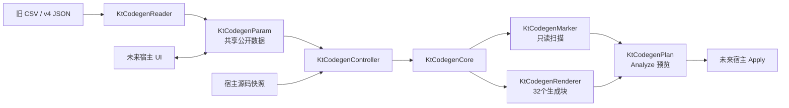

# KtCodegen 两小时迁移计划与验收

## 目标与边界

以 `KtAutoCode@kt-codegen-0.1.0` 为只读基线，在约两小时内把参数代码生成核心迁入 Phoenix Wing，形成可独立构建、测试和发布的 `@phoenix-wing/kt-codegen`。

本阶段只修改 `phoenix-wing`：不修改 `kt-auto-code`、`phoenix-desk-tools` 或历史 `KtAutoCode`，不执行 push。两个宿主的依赖接入、真实文件 Apply 和产品 UI 均留给后续独立任务。

## 时间盒

| 时间 | 工作 | 退出条件 |
| --- | --- | --- |
| 0～15 分钟 | 审计本地标签、Wing 多包规范与命名 | 明确来源标签、0.3.0 锁步版本及 `KtCodegen*` 领域例外 |
| 15～35 分钟 | 建立 `packages/kt-codegen` | package、exports、TS build、LICENSE/NOTICE 和 workspace lockfile 完整 |
| 35～65 分钟 | 迁入数据与旧格式兼容 | `KtCodegenParam`/`Item`、17列 CSV、v4 JSON、Combo 原值保留通过测试 |
| 65～95 分钟 | 迁入 Core/Marker/Renderer | Analyze 契约、标记扫描和32个生成块全部进入统一注册与 golden 测试 |
| 95～110 分钟 | 整理接口、fixture 与中文文档 | 类图、迁移矩阵、来源许可、各 Renderer 行为文档可在本包内独立阅读 |
| 110～120 分钟 | 执行发布门禁并本地归档 | typecheck、workspace tests、release matrix、tarball smoke 全通过；本地提交和标签完成 |

## 架构结果

`KtCodegenParam` 与 `KtCodegenItem` 保持类似 `struct` 的全公开、可变字段。Reader 完整读取后由 Adapter 原位更新共享实例；UI、Controller、Core 和 Renderer 因而能消费同一份数据。未知 Combo 字符串不被模型清空，宿主 UI 只负责提示和用户主动修正。

## 验收清单

- [x] 包名、目录和运行时身份统一为 `kt-codegen` / `@phoenix-wing/kt-codegen` / `kt.codegen.*`。
- [x] `KtCodegen*` 类、`ktCodegen*` 函数和 `KT_CODEGEN_*` 常量作为领域命名例外写入仓库规则。
- [x] 主要类一个类一个文件，公共字段显式标注类型并提供 JSDoc。
- [x] 17列 CSV 和 v4 JSON 可读写；旧扩展字段、表头和未知 Combo 值保持可往返。
- [x] Marker 只读扫描与 Analyze 计划不直接修改宿主源码。
- [x] 32个 CAA、Qt、普通 C++ 生成块全部有稳定 key、Renderer 或兼容策略。
- [x] 16 个测试文件、47 个 fixture/golden 文件进入 Phoenix Wing。
- [x] 根 README、多包总计划、版本矩阵、release matrix 与 tarball smoke 纳入新包。
- [ ] 两个宿主接入 npm 包并实现 Preview/Apply；不属于本时间盒。
- [ ] 从第二个真实消费者中识别可进一步提取的公共契约；不预先制造公共库。
