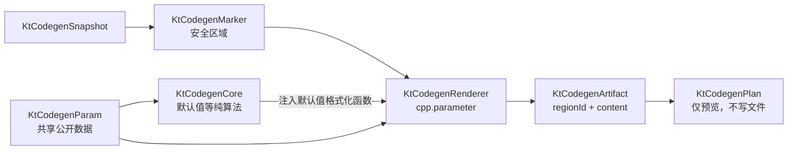

# 普通 C++ 参数块迁移

本文记录 `cpp.parameter` Renderer 第一组已迁移能力：旧 `KevinCAAFileGuide` 的参数声明、构造、析构和赋值四个自动代码块。

## 迁移范围

| ID | block key | 旧 VB 方法 | 当前状态 |
| ---: | --- | --- | --- |
| 10 | `PARAM CONSTRUCTOR` | `CreateCAAParamConstructor` | 已迁移 |
| 11 | `PARAM DECLARATION` | `CreateCAAParamDeclaration` | 已迁移 |
| 12 | `PARAM DESTRUCTOR` | `CreateCAAParamDestructor` | 已迁移 |
| 13 | `PARAM EQUAL` | `CreateCAAParamEqual` | 已迁移 |

权威实现仍是归档基线中的 `KtaAutoCodeBase/KevinCAAFileGuide.vb`。TypeScript 版本位于 [`KtCodegenRenderer.ts`](../src/KtCodegenRenderer.ts)，由 `KtCodegenCore` 注入旧默认值格式化函数，避免 Renderer 反向依赖 Core；基线位置见[《来源与许可归档》](来源与许可归档.md)。

## 数据流与职责

每个 artifact 对应一个已扫描的 `KtCodegenMarkerRegion.id`。区域保存文件指纹和替换偏移，artifact 保存目标、block、类身份和候选文本。当前包只形成 Analyze Plan；真实 Apply 必须由宿主根据 `regionId` 找到区域，在写入前重新检查文件指纹。

## 保留的旧行为

四个块都只消费与当前 `NameSuffix` 相同且 `id >= 1` 的 Item，并保持数据数组顺序。

### 参数构造

- `id === 1` 使用 `: `，其余 Item 使用 `, `；不按数组位置自动修正；
- 默认值复用 Core 中已经 golden 化的字符串、分号、毫米和角度规则；
- 旧方法对 `m_CurrentControlEnd.Trim()`，所以该块的 `clang-format on` 和 End 标记不保留 Start 缩进。新 Renderer 有意保留这一历史输出。

### 参数声明

- 生成旧版 `@app Kt Auto Code` 和 `@version 5.0.0, (2024)`；
- 按 `CodeAppendNotes(item, 0)` 输出 `brief`、可选 `author/date/note` 和 `id`；
- 相邻 Item 声明之间保留一个空行。

### 参数析构

- `CATISpecObject_var` 不区分大小写，重置为 `NULL_var`；
- 类型中任意位置包含 `*` 时重置为 `NULL`；
- 其他类型保留旧行为，输出被注释的默认值恢复语句。

### 参数赋值

- 普通类型生成 `value = iOriginal.value`；
- 旧代码判断条件是 `DataType.IndexOf("*") > 0`，因此常规指针复制语句被注释；
- 若 `*` 恰好是类型首字符，旧判断返回 false，新实现也不会擅自改变。

## 换行、缩进与可验证性

- Start 行最后一个 `//` 之前的 `linePrefix` 用于生成块缩进；
- 显式 `snapshot.eol` 优先，否则从文本检测 CRLF，默认使用 LF；
- 原 End 行有换行时 artifact 保留末尾换行，无换行时不额外添加；
- [`cpp-parameter-blocks.hpp`](../tests/fixtures/source/cpp-parameter-blocks.hpp) 提供四块旧源码；
- [`expected/cpp-parameter`](../tests/fixtures/expected/cpp-parameter) 保存逐块可人工审阅的 golden 文本；
- 测试另外覆盖 CRLF、`CATISpecObject_var`、常规指针和首字符星号。

## 当前边界

`cpp.parameter` 目标对这四个 block 返回 `ready`。只有源码标记结构无 error、存在至少一个 artifact、所有 artifact 都能关联区域，且本次请求的全部目标均为 `ready` 时，`plan.canApply` 才为 true。

这只表示计划具备 Apply 的基本条件，不表示本包已经写入文件。CAA 的二十六块和 Qt 的两个双向更新块已在后续阶段迁移，归档的32个旧 block 已全部建立 Renderer 与 golden 基线。
