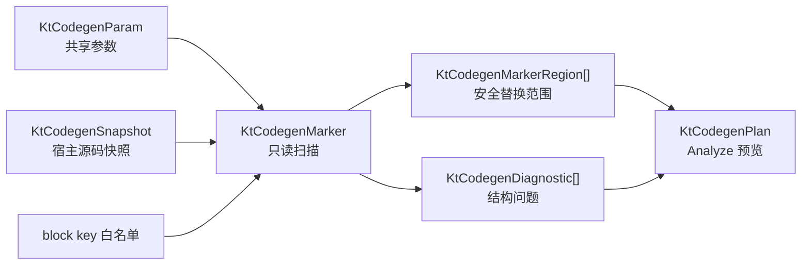

# 自动代码标记扫描

本文说明 `KtCodegenMarker` 如何兼容旧 `KevinCAAFileGuide` 的自动代码控制标记，并把原来直接搜索、替换文件的过程拆成可检查的只读 Analyze 数据。

## 旧实现依据

迁移以当前库归档的 VB 源码为准：

- 归档基线 `KtaAutoCodeBase/KevinCAAFileGuide.vb` 的 `CalulateStartControlWords`、`CalulateEndControlWords` 定义标记文本；
- 同一文件的 `SeachInCurrentFileText` 按行寻找 Start，跳过旧块内容，直到找到当前条目的 End；
- `AutoCodeWordsStart`、`AutoCodeWordsEnd` 把标记、`clang-format off/on` 和生成代码组成完整替换块；
- 归档基线 `KtaAutoCodeBase/KevinCAACreateItemModify.vb` 保存每个待修改条目的 Start、End 和文件命中次数。

归档标签和完整旧文件索引见[《来源与许可归档》](来源与许可归档.md)。

旧文本协议保持不变：

```cpp
// START KEVIN CAA WIZARD SECTION <NamePrefix><NameMiddle><NameSuffix> <block key>
// generated code
// END KEVIN CAA WIZARD SECTION <NamePrefix><NameMiddle><NameSuffix> <block key>
```

例如：

```cpp
  // START KEVIN CAA WIZARD SECTION KtCourseGuardItem PARAM DECLARATION
  int _MachineId;
  // END KEVIN CAA WIZARD SECTION KtCourseGuardItem PARAM DECLARATION
```

## 新职责边界



`KtCodegenMarker` 只构造和扫描控制标记。它不生成 CAA/Qt/C++ 业务代码，不修改 `KtCodegenParam`，也不读写文件系统。宿主先把已经按正确编码解码的文本放进 `KtCodegenSnapshot`，Core 再把扫描区域和诊断放入 `KtCodegenPlan`。

Renderer 后续产生 artifact 时，可使用区域的绝对偏移建立候选替换；真正写回、编码保持、指纹并发检查和失败回滚仍属于宿主或通用 code-core，不进入参数数据类。

## 区域数据

每个 `KtCodegenMarkerRegion` 包含：

- 稳定 `id`、文件路径、源文件指纹、`classId`、`nameSuffix` 和稳定 `blockKey`；
- Start、End 所在的0基行列；
- 两个标记、块正文和整块替换的绝对字符偏移；
- Start 行从最后一个 `//` 之前提取的 `linePrefix`，兼容旧 VB `_prefix` 行为；
- LF、CRLF 或末行无换行时仍可直接对原始字符串切片验证的范围。

扫描只把“当前 Param 中存在的 `NameSuffix` + 本次 block key 白名单”作为候选。没有打开当前块时，其他类和未请求 block 的合法标记保持原样，允许一个文件中存在多套参数生成代码。任何语法完整 marker 都是同级边界，但未选择的正常 Start/End 对不会因此产生诊断。

## 比旧实现更严格的安全检查

旧 `SeachInCurrentFileText` 在找到 Start 后，只等待当前 End，中间出现的其他控制标记会被静默跳过。新扫描器不直接替换，因此可以在预览阶段阻止有歧义的范围：

| 诊断代码 | 含义 | 结果 |
| --- | --- | --- |
| `marker.missing-end` | 文件结束或下一条语法完整 marker 前仍未找到对应 End | error；上一块不产生区域，边界行写入 message，并清空旧状态 |
| `marker.orphan-end` | End 前没有对应 Start，或错配 End 已与旧 Start 分开诊断 | error；End 不产生区域，后续块仍可恢复 |
| `marker.ambiguous-line` | 同一行同时含 Start 和 End | error |
| `marker.malformed` | 标记固定文本与类身份之间格式错误 | error |
| `marker.malformed-payload` | 缺少类身份或 block 区分词 | error |

控制块严格同级、不允许嵌套。遇到下一 Start 时，旧 Start 只报一次 `missing-end`，随后把新 Start 作为新块起点；遇到错配 End 时，旧 Start 报 `missing-end`，该 End 独立报 `orphan-end`，旧状态立即清空。扫描器绝不会把边界 marker 当成缺失 End，也不会把两个 marker 之间的手写代码纳入替换区域。

不属于归档32块的语法完整控制标记不是错误，扫描器静默保留原文；它只在已有已选块打开时充当边界。上述检查不自动修复源码。UI 可以用文件、行、列定位提示用户；只有标记结构无 error、目标 Renderer 已迁移并产生 artifact 时，计划才可能进入 Apply。

## 当前阶段限制

- 已完成旧标记构造、扫描、配对、偏移和 Analyze Plan 接口；
- 已覆盖多区域、LF/CRLF、孤立、连续缺失、下一 marker 恢复、错配 End 独立化和其他类共存测试；
- 普通 C++ Parameter、CAA 与 Qt 的32块归档旧生成能力均可产生关联 `regionId` 的 artifact；
- `plan.canApply` 只表示计划满足基本条件，本包仍不执行真实写回；
- 不在本原型中实现真实文件写入，也不修改 Phoenix Wing、`kt-auto-code` 或 `phoenix-desk-tools`。
